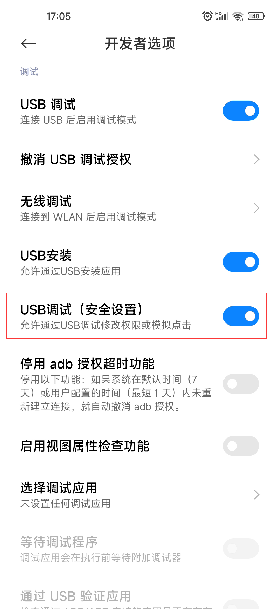
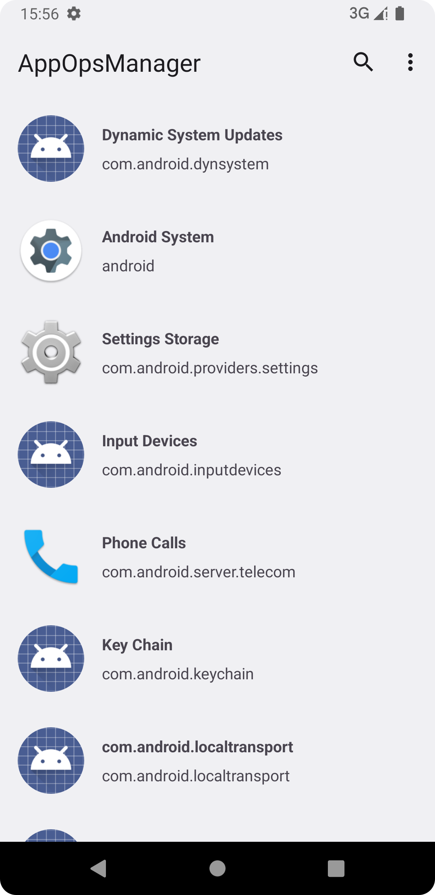
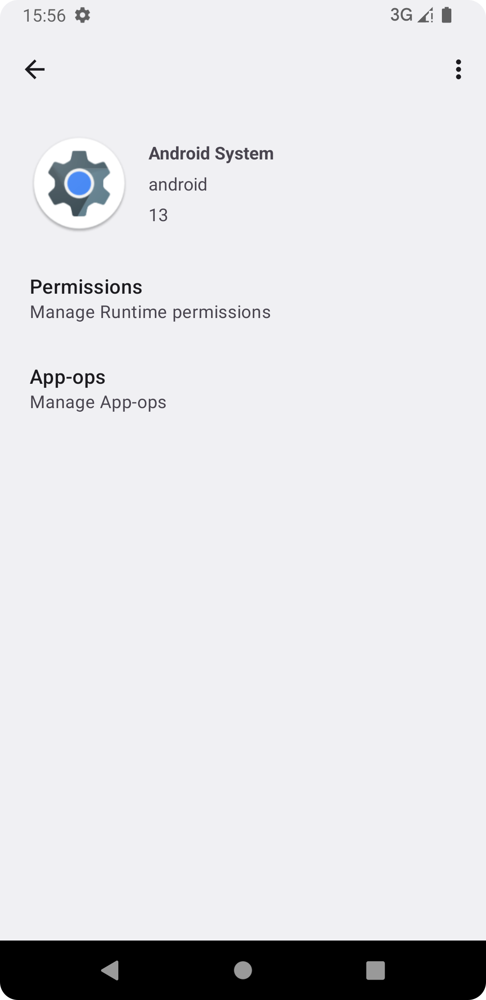
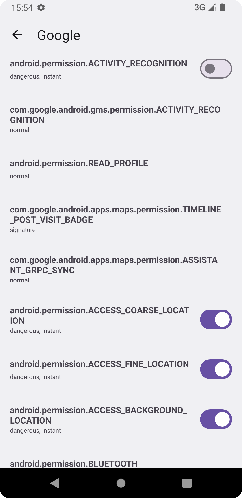
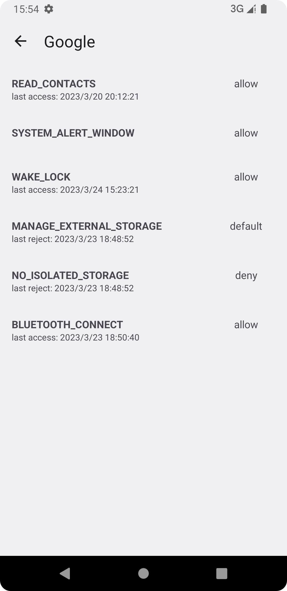
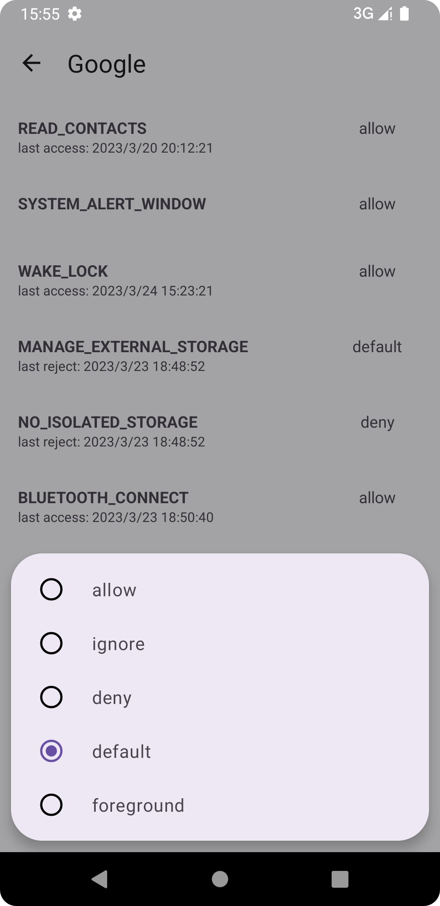
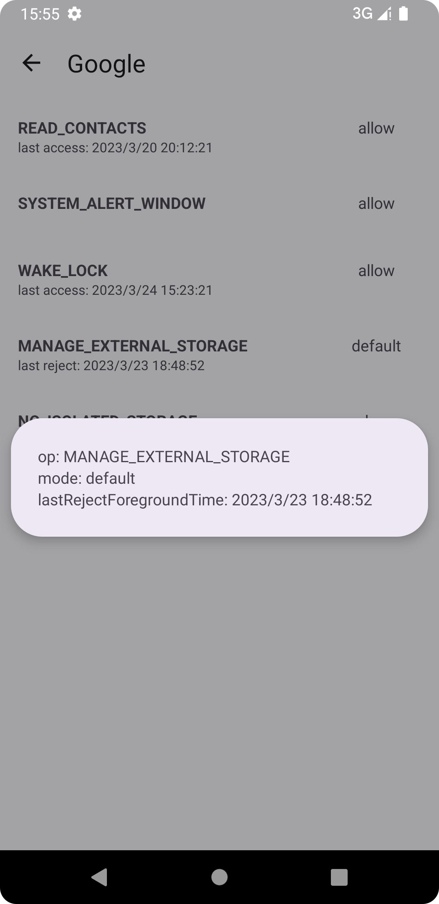

# AppOpsManager
一个能够对应用运行时权限和AppOps管理的工具
## 如何工作？
### app_process
app_process是Android系统进入Java世界的入口。我们可以通过adb来执行app_process，以此创建一个uid为2000的代理服务进程，该进程具有和shell一样的权限等级，能够更改应用的运行时权限和AppOps。
### ContentProvider
利用ContentProvider与我们的应用进行跨进程通信，获得代理服务的句柄。应用对运行时权限和AppOps的管理操作将会委托给代理服务执行。
## 注意事项
部分手机厂商的定制系统，对adb进行了权限限制，使得应用无法正常工作。一般来说也提供了该限制的开关（eg. MIUI上的"USB调试(安全设置)"），请留意你的手机是否有与该语义类似的开关。 

## 截图

